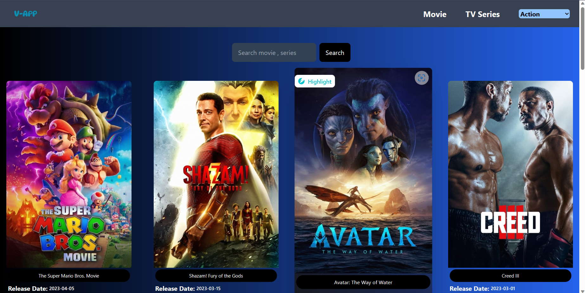
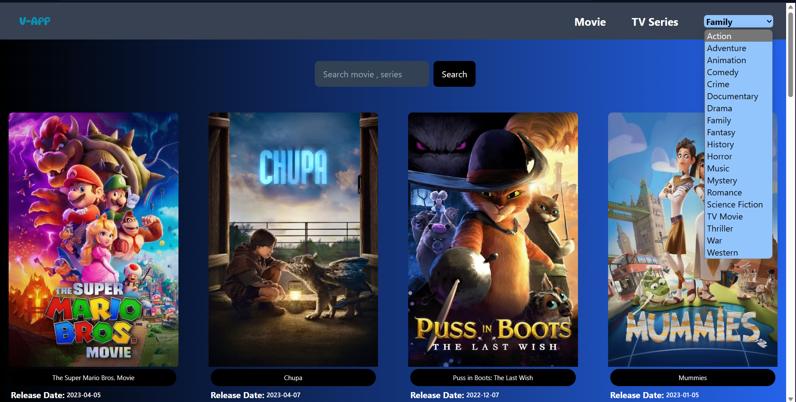

# Movie App 

## Main page ##

## Genre section ##

## Skills Gained
1. React js <https://reactjs.org/>
2. React hooks <https://reactjs.org/docs/hooks-intro.html>
3. Tailwind css  <https://tailwindcss.com/>
4. Use of external API

## Features added:
1. Genre features 
2. Divided into sections(movies and tv series ) with their genres
3. Responsive website
4. Dropdown menu

